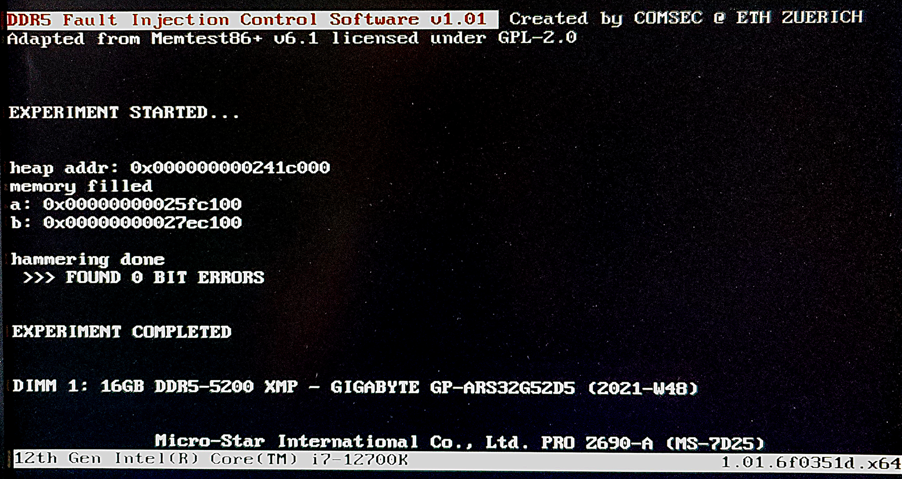

# Memtest Control Software
This is a modified version of [Memtest86+](https://github.com/memtest86plus/memtest86plus) with support added for the DDR5 fault injection controller.



## Build and Debug
Helper scripts were added to `scripts` which automate the process
of creating a debug build and attaching GDB.

1. Go to `build64`
2. Run `make run`

This will compile Memtest and create a disk image for QEMU. It will then
launch QEMU and wait for GDB to connect via localhost:1234.

3. In a different terminal (in build64), run ```gdb -x gdbfile``` to start 
gdb. The virtual machine can then be resumed by typing ```c```.

## Make a USB image
The generated image by `make run`, `disk.img`, can directly be 
flashed to a USB drive using `dd`
~~~
dd if=disk.img of=/dev/sdX status=progress
~~~

## Generate an image for PXE
To generate an image for automated PXE boot, `memtest.efi`,
created by default `make` target is used.

The PXE server expects the image to be at
`/var/ftpd/<MAC address>/memtest_pxe`.
For each node, there is also a symlink from `/var/ftpd/cnXXX` to
`/var/ftpd/<MAC address`.
The image can thus be deployed for a specific node using
`sudo make deploy NODE=cnXXX`.

A more complete example (with fault injection parameters):
~~~
sudo make deploy NODE=cn115 REBOOT=$(pwd)/reboot.sh DURATION=2000 TITLE="mytitle" BURST_COUNT=5 INTER_FAULT_DELAY=500 ROW_IDX=0 HAMMER_COUNT=40000 AGGR_A=7 AGGR_B=15 MODULE_SIZE=16
~~~

## Communicating with the injection controller
To trigger a fault, a packet can be constructed using the protocol
defined in the thesis. 
This 64 byte buffer can be passed to `send_data_uc_ep(global_ws, buf)`,
where `global_ws` is the workspace created during USB initialization
(global variable).

## Known Issues
Do not rely on the reported number of bit errors.
This actually show the number of **corrupted bytes**. Also, it does not take
into account completely corrupted data, i.e., corruptions that are not
Rowhammer bit flips.
When using `__builtin_popcount`, I am getting this error which requires
some more investigation:
~~~
build64/../tests/ddr5_test.c:328:(.text+0xb90): undefined reference to `__popcountdi2'
~~~
